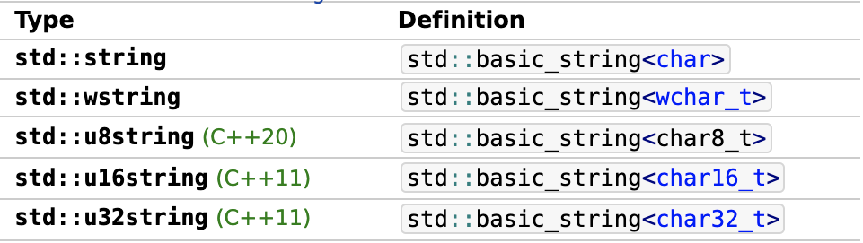
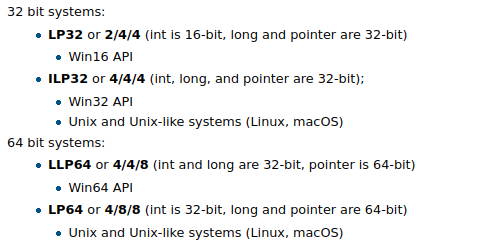
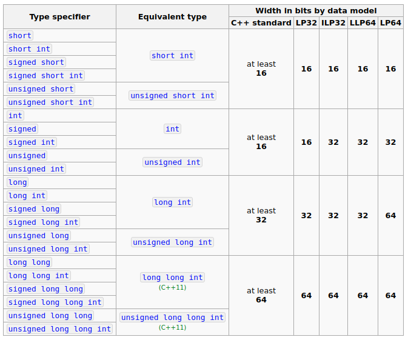
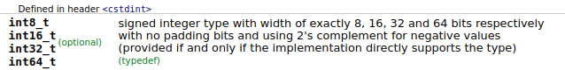

# C++数据类型 (Type System)
一门编程语言的数据类型系统决定了它是如何在内存中管理数据的，内存中的二进制字节序列因不同的数据类型从而具备了不同的语义信息。对C++来说，对象(Objects)、引用(References)、函数(functions)以及表达式(expressions)都有对应的的数据类型，总体来说C++的数据类型系统可以做如下分类：
- __基础类型__(Fundamental Types): 其中绝大部分也被称为基本内置类型(primitive built-in types)
  - 算术类型(Arithmetic Types): 能直接进行加减乘除等各种算术运算的数据类型
    - 整型(Integral Types)
      - 布尔型: `bool`
      - 字符型(character types): 窄字符型包括 `char, signed char, unsigned char` 等，宽字符型包括 `wchar_t, char16_t, char32_t` 等主要用于Unicode字符集
      - 整数类型(integer types): `short, int, long, long long` 等整数类型，这些都支持无符号版本(`unsigned`)
    - 浮点型(Floating-point Types): `float, double, long double`
  - 特殊数据类型
    - `void`: 一般用来修饰函数返回值类型或者指针，表示函数没有返回值以及不明类型的指针等
    - `nullptr_t`: Since C++11, type of `nullptr`. 
- __复合类型__ (Compound Types)
  - 引用类型(reference types): 左值引用，右值引用等
  - 指针类型(pointer types): 对象指针，函数指针，指向类成员的指针，空指针，void *等
  - 数组类型(array types)
  - 枚举类型(enumeration types)
  - 类类型(class types): union or non-union types
  - 函数类型(function types) 

Refer to [[C++ Type System](https://en.cppreference.com/w/cpp/language/type)](https://en.cppreference.com/w/cpp/language/type)

------
## 1. 基础类型(Fundamental Types)
Also called primitive built-in types
### 1.1 整型 (Integral Types)
C++语言中定义了各个整型的含义，以及绝大多数整型的最小尺寸，但并未严格限定每种整型的固定大小，整型的具体所占字节数视平台和实现而定，可使用`sizeof(_type name_)`来查看某个类型在本地实现的具体大小
#### 1.1.1 布尔类型
`bool`, 取值范围 [`true`, `false`]，最小尺寸未定义，`sizeof(bool)`在绝大多数机器上应该都是 1
#### 1.1.2 字符型
`char`, `wchar_t`, `char16_t`, `char32_t` - `char`的最小尺寸为8位，早期的计算机中`char`足以应付所有的字符，后期根据字符集的不断发展和扩大，字符类型的大小也做了相应的扩展
   - 在随后的设计中，`wchar_t`就被期望能满足所有的字符需求，它在绝大多数系统中都是32位的长度，只有Windows系统中是个例外，占16位，表示一个UTF-16的code unit
   - C++11之后，对于字符类型的设计做了更进一步的细分，`char16_t`专门用来适配UTF-16编码，最小尺寸16位，`char32_t`用来适配UTF-32编码，最小尺寸32位
   - C++20补充了新的字符类型`char8_t`，用于适配UTF-8编码，补全了对整个Unicode字符集的支持

我们在C++中各种`string`的实现里面可以看到这些对应的字符类型, Specializations of the basic_string<> template.

   

需要注意的是虽然`std::string`是由8位的char组成的，但并不代表它不能容纳Unicode字符串，在Linux系统中，`std::string`采用的是UTF-8编码来操作字符串，Windows系统中，`std::string`的编码应该是跟当前系统的本地化配置(locale)有关系[[Details: Windows Strings]](https://docs.microsoft.com/en-us/cpp/cpp/string-and-character-literals-cpp?view=msvc-170)。

参考`StringEncodingDemo()`:
```C++
void StringEncodingDemo()
{
    //default string: utf-8 encoding 
    std::string s = "你好";
    std::cout << "chars count of using std::string: " << s.length() << std::endl;
    std::cout << "sizeof char: " << sizeof(s[0]) << std::endl;

    std::cout << "chars (ordinals #hex): ";
    for (auto c: s)
    {
        unsigned char uc = static_cast<unsigned char>(c);
        std::cout << " " << std::hex << static_cast<unsigned int>(uc);
    }
    std::cout << "\n--------------------\n";
    ....
}
```
[[UTF-8 Encoder]](https://www.browserling.com/tools/utf8-encode)
#### 1.1.3 整数类型
C++中整数类型的核心是`int`，它的最小尺寸保证是16位，然后通过如下两类修饰符(modifiers)来衍生出各种不同的整数类型
- 符号(Signedness): `unsigned`、`signed`, 通常`signed`是默认的，在类型声明中可以省略
- 大小(Size): `short`、`long`、`long long`(Since C++11)

两种修饰符可以组合成任意的整数类型，一般`signed`, `int`在类型声明中都可以省略。比如 `signed long long int` = `long long`

各整数类型的具体大小，即所占字节数，根据各个操作系统和平台结构的不同而不同，C++这些基础类型的实现统称为data models，常见的四种数据模型如下：\
\
对于我们常见的Unix 64位的操作系统来说，适配LP64模型，`short`是16位，`int`32位，`long`和`long long`都是64位。因为数据模型的原因，C++的代码在跨平台移植、交互的时候需要注意兼容性\
所有整数类型如下图:\


如果对数据类型的固定长度有很高的要求，可以考虑使用`定长整数类型`(Fixed width integer types), 它能保证在各平台下都有一致的大小。目前ZROS平台里面应该普遍都在用这种数据类型



[[Details: Fixed width integer types]](https://en.cppreference.com/w/cpp/types/integer)

在本机上查看数据类型的大小一般使用sizeof()方法，查看具体类型的最大值最小值，C++11之后可以使用`numeric_limits`类，之前可以使用`limits.h`里面定义的各种宏:
```C++
void SizeofDataTypesDemo()
{
    std::cout << "sizeof(short): " << sizeof(short) << std::endl;
    //Range [-32768, 32767]
    std::cout << "Maximum value of short: " << SHRT_MAX << std::endl; //Macro defined in limits.h
    std::cout << "Maximum value from numeric limits: " << std::numeric_limits<short>::max() << std::endl; //Since C++11

    std::cout << "sizeof(unsigned short): " << sizeof(unsigned short) << std::endl;
    std::cout << "Maximum value of unsigned short: " << USHRT_MAX << std::endl; //Macro defined in stdint.h
    std::cout << "Maximum value from numeric limits: " << std::numeric_limits<unsigned short>::max() << std::endl;
}
```
### 1.2 浮点数类型
包括`float`, `double`,`long double`三种，一般`float`是32位，`double`是64位，`long double`是128位，但是在大多数平台上`long double`只使用了80位有效位数来描述一个浮点数，少数平台支持全部的128位超高精度浮点数。

浮点数类型有三个特殊值要注意一下
1. _带负号的零_ (Negative zero) - 算术上它与零相等，主要用于生成`-INFINITY`
2. _INFINITY_ - 无穷大，分别有正无穷和负无穷
   - `INFINITY` 与所有数值的加减乘除均为INFINITY
   - `INFINITY` 与同样符号的`INFINITY`相等
   - C++11之后可以用`std::isinf()`来检查数值是否是`INFINITY`
3. _NAN_ (Not a Number) - 代表非法的数值
   - NAN与所有数值的加减乘除均为NAN
   - NAN不等于任何数值，也不等于同样的NAN
   - C++11之后可以用`std::isnan()`方法来检查某个浮点数是否是NAN
  
参考下面的FloatPointSpecialValuesDemo():
```C++
void FloatPointSpecialValuesDemo()
{
    double zero = 0.0;
    double neg_zero = -0.0;      //Negative zero
    //Infinity values
    std::cout << "positive infinity: " <<  1.0 / zero << std::endl;
    std::cout << "negative infinity: " <<  1.0 / neg_zero << std::endl;
    //use std::isinf() to check infinity values since C++11, include <cmath>
    std::cout << std::boolalpha << "isinf(INFINITY): " << std::isinf(INFINITY) << std::endl
              << "isinf(-INFINITY): " << std::isinf(-INFINITY) << std::endl
              << "isinf(INFINITY - 1): " << std::isinf(INFINITY - 1) << std::endl
              << "isinf(INFINITY + 1): " << std::isinf(INFINITY + 1) << std::endl
              << "isinf(INFINITY * 2): " << std::isinf(INFINITY * 2) << std::endl
              << "INFINITY == INFINITY: " << (INFINITY == INFINITY) << std::endl;
    //NaN values
    std::cout << std::boolalpha
              << "isnan(NaN): " << std::isnan(NAN) << '\n'
              << "isnan(0.0): " << std::isnan(0.0) << '\n'
              << "isnan(Inf): " << std::isnan(INFINITY) << '\n'
              << "isnan(Inf + 1): " << std::isnan(INFINITY + 1) << '\n'
              << "isnan(Inf + Inf): " << std::isnan(INFINITY + INFINITY) << '\n'
              << "isnan(Inf - Inf): " << std::isnan(INFINITY - INFINITY) << '\n';
    char* end;
    std::cout << std::boolalpha
              << "isnan(strtod(\"NaN\")): " << std::isnan(std::strtod("NaN", &end)) << std::endl;
}
```
-------------
### 1.3 给算术类型赋值
C++算是一种类型不安全的语言(type unsafety)，在给算术类型赋值的时候，存在一些隐式类型转换，并且潜在的溢出情况也需要注意
1. 可以给`bool`类型赋一个整数值，只要非零的值都是`true`
2. 反过来`bool`值赋给整数类型时，true = 1， false = 0
3. 浮点数的值赋给整数类型时，会丢失精度，保留整数位
4. 给无符号整型赋一个越界的值 `val` ，所得的结果为`val`对这个类型所占的位数的二次幂取模之后的余数，虽然这种赋值明显是错误的，但C++中它造成的后果是一种 well-defined behavior，不会引起任何运行时异常
   > 以16位`unsigned short int`为例，它的取值范围为[0, 65535], 如果给它赋值65540，实际所得的值应该是 4 \
    因为 65540 = 1 * (2^16) + 4, 余数为 4
5. 给有符号整型赋一个越界的值，造成的结果是undefined behavior, 无法预计，大多数情况下会得到一个取模之后的值，与无符号整型是一样的处理，但也有可能会得到一个非法值，或者程序崩溃。应尽量避免这种错误。
6. 在无符号整型与有符号整型一起做算术运算的时候，有符号的会被先转化成无符号整型做运算，所以尤其要注意当有符号整数转化成无符号时越界的这种情况。另外，所有算术运算中，低于32位的数值都会被promoted成signed int再做计算

以上这种越界的潜在赋值错误，都可以在编译时通过`-Woverflow`选项来让编译器报警
  
  参考AssignValuesDemo()
  ```C++
  void AssignValuesDemo()
  {
      bool b = false;
      b = 42; //should be true, any integer value assigned to a bool type should be true except 0
      std::cout << std::boolalpha << "b is " << b << std::endl;

      //bool values assigned to a integer type, true -> 1, false -> 0
      int i = b;
      std::cout << "i = " << i << std::endl;

      //float-point values assigned to a integer type, will lose precision
      i = 3.14159;
      std::cout << "i = " << i << std::endl;

      //Assign a value outside the range of an unsigned integer type
      //result is the remainder of (value mod 2**(bits of type))
      unsigned short us = 65560; // 65560 mod 2**16 -> 65560 = 1 * 65536 + 24
      std::cout << "us = " << us << std::endl;
      us = -2;                   // -2 mod 65536 -> -2 = -1 * 65536 +65534
      std::cout << "us = " << us << std::endl;

      //Assign a value outside the range of a signed integer type
      //result is undefined behavior, the most critical error we should be avoid.
      short s = 70000;
      std::cout << "s = " << s << std::endl;

      unsigned int u = 10;
      int i2 = -42;
      std::cout << "u + i2 = " << u + i2 << std::endl; // -42 would be converted to unsigned int

      unsigned short u2 = 10;
      short s2 = -42;
      // u & s2 were promoted to signed int in arithmetic operations
      // the same as: (int)u2 + (int)s2
      std::cout << "u2 + s2 = " << u2 + s2 << std::endl;

      unsigned char uc = 10;
      signed char c = -42;
      //promoted too
      std::cout << "uc + c = " << uc + c << std::endl;
  }
  ```
### 1.4 字面值 (Literals)
字面值就是一个很直观的值(self-explaning)，常用于赋值表达式的右边，每一个字面值都有对应的数据类型，编译器根据它的值以及前后缀等形式来推断它的数据类型
#### 1.4.1 整数字面值 (Integer literals)
表示一个整数，对于整数字面值来说，编译器推断出来的数据类型至少都是`int`，不存在`short`这种字面值整数类型。所以下面的代码应该显示是4字节
```C++
auto i = 10;       //decimal-literal
std::cout << "sizeof(i) = " << sizeof(i) << std::endl;
```
能在数值后面加上各种后缀来告知编译器这是一个`long int`，或者是`long long int`，或者是无符号类型等等
```C++
auto i_l = 10l;    // suffix l/L means signed long int
std::cout << "sizeof(i_l) = " << sizeof(i_l) << std::endl;
auto i_ll = 10LL;  // suffix LL/ll means signed long long int
std::cout << "sizeof(i_LL) = " << sizeof(i_ll) << std::endl;
auto i_u = -10u;   // suffix u means unsigned, -10 definitely overflow
std::cout << "i_u = " << i_u << std::endl;
```
一个整数字面值支持四种进制的表示方法，二进制、八进制、十进制和十六进制
```C++
auto i_b = 0b1010; //binary-literal
auto i_o = 012;    //octal-literal
auto i_h = 0xA;    //hexademical-literal
std::cout << "i i_b i_o i_h: " << i   << " " << i_b << " " 
                               << i_o << " " << i_h << " " << std::endl;
```
#### 1.4.2 浮点数字面值 (Floating-point literals)
一个浮点数字面值的类型由下面几种后缀来决定：
- (no suffix) defines a `double`
- f/F defines a `float`
- l/L defines a `long double`

```C++
auto f = 3.14159f;  // suffix f/F represents a float type
std::cout << "sizeof(f) = " << sizeof(f) << std::endl;
auto d = 3.14159;   // no suffix represents a default double type
std::cout << "sizeof(d) = " << sizeof(d) << std::endl;
auto ld = 3.14159L; // suffix l/L represents a long double type
std::cout << "sizeof(ld) = " << sizeof(ld) << std::endl;
```
浮点数的科学计数法表示

```C++
auto f_e = 3.14159e5; //科学计数法来表示一个浮点数, e/E 作为指数标记
std::cout << "f_e = " << f_e << std::endl;
```
#### 1.4.3 字符型、字符串字面值 (Character/String literals)
字符型和字符串字面值采用相同的前缀来决定具体的数据类型
- No prefix -> default `char` type, 1 byte
- 'L' prefix -> defines a `wchar_t` type, 4 bytes
- 'u' prefix -> defines a `char16_t` type, 2 bytes
- 'U' prefix -> defines a `char32_t` type, 4 bytes 

```C++
auto c = 'a';       //default char type with no prefix
std::cout << "sizeof(c) = " << sizeof(c) << std::endl;
auto wide_c = L'a'; // L prefix represents a wide character, wchar_t
std::cout << "sizeof(wide_c) = " << sizeof(wide_c) << std::endl;
auto u16_c = u'a';  // u prefix represents a char16_t, utf-16 character
std::cout << "sizeof(u16_c) = " << sizeof(u16_c) << std::endl;
auto u32_c = U'a';  // U prefix represents a char32_t, utf-32 character
std::cout << "sizeof(u32_c) = " << sizeof(u32_c) << std::endl;
```
字符串字面值的前缀一样，具体参考前面的StringsEncodingDemo

### 1.5 变量的声明 (Variables declaration)
变量的声明主要由两个部分组成: 
- 修饰符序列(specifier sequence): 主要就是指明变量的数据类型、是否常量等等
- 声明符序列(declarator list): 一个声明符由 变量名称(identifiers) 以及 引用符号`&`, 指针符号`*`...等组合而成

>_decl-specifier-seq init-declarator-list_

#### 1.5.1 修饰符(Specifier)
主要就是指明变量的数据类型、是否常量等等
1. 指明变量的数据类型 (type specifiers) - 前面提及的各类基本数据类型都是修饰符，包括`class`, `enum`, `struct`, `union`...等复杂数据类型
2. `typedef`, `inline`, `friend`, `constexpr`等各类访问修饰符、常量表达式修饰符、其它各种特殊用途的修饰符等等
   
详情参考[[Specifiers]](https://en.cppreference.com/w/cpp/language/declarations)

#### 1.5.2 标识符(Identifier)
主要用于指定一个变量的名称，它由数字、拉丁字母、下划线组成，可任意排列但要注意以下几点
1. 不能以数字开头，会导致编译失败 `(e.g. int 3i; //compile error)`
2. 不能与任何C++关键字(keywords)重名，会导致编译失败
3. 大小写敏感
4. 以下几种命名方式编译能通过，但通常这类命名方式被标准库所保留(reserved)，容易重名
    - 名称中不要出现连续两个下划线(`__`)，尤其是名称开头和结尾部分
    - 名称不要以 下划线+大写字母 开头(`e.g. _A`)
    - 全局变量的名称中不要以下划线开头

#### 1.5.3 声明符(Declarator)
一个声明符由变量标识符以及引用符号`&`/`&&`, 指针符号`*`...等组成，引用和指针与简单数据类型组合成复合类型(compound types)
```C++
int a = 1, *p = nullptr, f(), (*pf)(double);
// decl-specifier-seq is int
// declarator a = 1 defines and initializes a variable of type int
// declarator *p = nullptr defines and initializes a variable of type int*
// declarator (f)() declares (but doesn't define)
//                  a function taking no arguments and returning int
// declarator (*pf)(double) defines a pointer to function
//                  taking double and returning int
```
详情参考[[Declarations]](https://en.cppreference.com/w/cpp/language/declarations)

----------
## 2. 复合类型 (Compound types)
本章主要介绍引用、指针以及数组等复合类型
### 2.1 引用 (reference)
引用就是给已存在的对象起的一个别名，它在内存中没有属于自己的实体数据，声明符形式: `&`_`var`_
> A reference is not an object. Instead, a reference is just another name for an already existing object.

引用类型的声明：
```C++
int i = 42;
int &ref_i = i; //ref_i is a reference of i
std::cout << "ref_i = " << ref_i << std::endl;
```
对引用的所有修改操作直接影响其绑定的对象
```C++
ref_i = 0;
std::cout << "i = " << i << std::endl;
```
需要注意的几点：
1. 引用在声明的时候必须被初始化，不存在默认值

   ```C++
   int &ref_i2;    //compile error: reference must be initialized
   ```
2. 引用在初始化之后，无法再绑定到其他的对象，没有这样的语法
3. 引用只能绑定实体对象，不能绑定另一个引用，即：不存在引用的引用 
4. 不能用字面值来初始化一个引用

   ```C++
   int &ref_i3 = 1024; //compiler error: reference cannot bind to a literal value
   ```
5. 声明引用的数据类型必须与其绑定的对象数据类型一致

   ```C++
   double d = 3.1415
   int &ref_d = d; //compiler error: type of reference must be the same as the binding object
   ```
参考`ReferencesDemo()`;
### 2.2 指针(Pointer)
__指针__ 是“指向”另外一种类型的复合类型，它的声明符形式`*var`，其中`var`是该指针变量的名称。
- 它使用 __取地址符&__ 来获取目标对象的内存地址
- 对指针使用 __解引用符* (dereference)__ 来获取目标对象的实体数据

   ```C++
   int val = 42;
   int *p_val = &val; //get the memory address of val
   std::cout << "The value of p_val point to: " << *p_val << std::endl; //dereference p_val
   ```

与引用类似，指针也实现了对其他对象的间接访问。但是它与引用还有很多不同之处：

1. 引用本身在内存里没有对应的实体，它只是另外一个对象的别名。指针不同，它本身存储了指向另外一个对象的内存地址，在32位机器上是32位地址，64位机器上是64位地址。所以指针本身是有实体数据的。

   ```C++
   int i = 5;
   int *pi = &i; //pointer declaration
   std::cout << std::hex << "The value of pi (the address of i) = " << pi << std::endl;
   ```
   上面代码中的指针`pi`在64位机器上打印出来一般都是48位的值，是因为目前绝大多数CPU都只用了48位的地址空间(能应付2^18次方GB的内存)，高16位保留了。

   Linux 系统可使用 `cat /proc/cpuinfo` 来查看CPU详细信息

2. 指针无需在声明的时候赋初始值，未初始化的指针拥有一个不确定的值(Undefined behavior)，使用它时程序一般都会crash，但也有可能会继续错误的运行下去，需要尽量避免这种不可预计的后果

   ```C++
   int *p; //don't need to be initialized
   std::cout << std::hex << "The value of uninitialized p: " << p << std::endl; //a random memory address
   std::cout << "The value p point to: " << (int)*p << std::endl; //probably crashed here
   ```
   > __ATTENTION__: 初始化所有的指针，如果暂时不知道给指针赋什么值，可以用NULL或者0来初始化一个空指针，C++11之后可以用`nullptr`来初始化空指针

   我们可以直接将指针作为if语句的判断条件，如果该指针为`nullptr`或者`0/NULL`这样的空指针，if 语句返回false，否则为true
   
   ```C++
   int *p_null = 0;
   p_null = NULL;
   p_null = nullptr; // all the same to initialize a null pointer
   if (!p_null)
      std::cout << "p_null is a null pointer" << std::endl;
   ```
   所以当我们使用一个来路不明的指针时，比如在一个函数体内使用作为参数传进来的指针，最好是先判断它是否为空指针，以免对它解引用时报错导致程序crash
3. 引用在其初始化后就一直与初始对象绑定，但是指针在其生命周期内可以再指向不同的对象

   ```C++
   int i2 = 6;
   pi = &i2;
   std::cout << "now p2 point to i2: " << *pi << std::endl;
   ```
   
4. void * 指针
   
   void* 指针相当于一种泛型指针，可以将任何类型的指针赋给一个void×类型的指针变量，它能指向任何类型的对象。只是在解引用的时候需要先转化成对应的数据类型才能使用
   
   ```C++
   void VoidPointersDemo()
   {
       //void pointers
       double d = 3.14159;
       double *pd = &d;
       void *vp = pd;
       std::cout << "*vp = " << *(double *)vp << std::endl;
   }
   ```
#### 指针之间的比较
对于两个类型相同的合法指针，可以使用相等操作符`==`和不等操作符`!=`来比较它们。如果它们存放的地址值是相等的，则比较结果为true。地址值相等主要有以下三种情况：
1. 两个指针都为空
2. 两个指针指向同一个对象

   ```C++
   //references comparation
   int *p1 = nullptr;
   int *p2 = nullptr;
   std::cout << std::boolalpha << "p1 == p2: " << (p1 == p2) << std::endl;

   int a = 5;
   p1 = &a;
   p2 = &a;
   std::cout << std::boolalpha << "p1 == p2: " << (p1 == p2) << std::endl;
   ```

#### 对指针的引用
指针本身是一个对象，所以也存在对指针的引用。但这种声明有时候不太容易读懂，比如下面例子中的`rp3`变量是对指针`p3`的引用，形如`int *&rp3 = p3;`，对于这种形式的复合类型声明，我们遵循从右到左的顺序去阅读，首先是`&`符号，说明`rp3`变量是个引用，其次是`*`符号，说明`rp3`所绑定的对象是一个指针。

```C++
//reference to a pointer
int b = 1;
int *p3 = &b;
int *&rp3 = p3; //read from right to left
std::cout << "*rp3 = " << *rp3 << std::endl;
```

## 3. CV限定符(cv-qualifiers)
cv是`const`/`volatile`这两个关键字的简称，这两个关键字一般用于修饰各种变量，会限定变量的很多行为，所以也称为限定符(qualifiers)
### 3.1 const限定符
被const修饰的变量一般也称为常量，它具有如下特性:
1. 常量不可被修改
   
   所有可能造成常量被修改的操作均会导致编译错误，典型的比如给常量赋值，即便赋一个一样的值也不行
   
   ```C++
   const int BUF_SIZE = 42;
   BUF_SIZE = 42; //error: const object cannot be modified
   ```
2. 常量必须在声明时就被初始化、
   
   常量不会使用各种数据类型的默认值来初始化变量，必须显式的在声明时初始化常量。可以使用字面值、或者返回相同数据类型的函数来初始化常量
   
   ```C++
   int GetBufSize() { return 42; }

   const int BUF_SIZE = 42;
   const int BUF_SIZE2 = GetBufSize();
   ```
3. 常量和非常量之间可以相互copy，只要数据类型一样. 

   ```C++
   int i = BUF_SIZE;
   i = 0; //i can be modified after copy from the const BUF_SIZE
   std::cout << "i = " << i << std::endl;
   std::cout << "BUF_SIZE = " << BUF_SIZE << std::endl;

   const int i2 = i;
   i2 = 42;//error: i2 cannot be modified
   ```
### 3.2 const引用 (reference to a const)
引用本身不是一个对象，所以这里的const不是用来修饰引用的，实际上它是一个针对const常量的引用
1. 与常量一样，常量的引用也不能被修改
2. 可以将一个常量引用绑定到非常量的对象上，反之则不行。因为普通的对象同时具备读、写两种属性，常量引用绑定上去之后，通过这个引用我们只能读原始对象，限制了对原始对象的写操作，这是允许的。而如果将一个普通引用绑定到常量对象上，则通过引用可以对原始常量进行写操作，破坏了常量的定义。
   
   ```C++
   void ConstReferenceDemo()
   {
      const int ci = 42;
      const int &r1 = ci; //reference to const variable ci
      //r1 = 0;       //error: cannot modify the value of a const reference
      //int &r2 = ci; //error: non const reference to a const variable

      int i = 42;
      const int &r3 = i; //it's ok, const reference can be bind to a nonconst variable
      //r3 = 0; //error: cannot modify i by its const reference
   }
   ```
### 3.3 const与指针
跟引用不同的是，指针本身就是一个对象。所以当const和指针组合在一起时，指针既能指向一个常量的对象，本身也可以是一个常量的指针，也可能两者兼具
1. 指向一个常量对象的指针
   - 指针本身需要使用const限定符来声明 `e.g. const int *p`
      
      ```C++
      //a plain pointer point to const object
      const int i = 42;
      //int *pi = &i; //error: nonconst pointer point to a const object
      ```
   - 与引用一样，声明之后不能再通过该指针去修改其指向的常量对象
      
      ```C++
      const int *cpi = &i;
      std::cout << "*cpi = " << *cpi << std::endl;
      //*cpi = 0; //error: pi point to a const object
      ```
   - 但是指针本身可以被修改，即可以指向另外的对象，即便这个新对象不是常量也行
      
      ```C++
      int j = 10;
      cpi = &j; // it's ok, pointer itself can be changed
      std::cout << "*cpi = " << *cpi << std::endl;
      ```

2. 一个常量指针 `e.g. int *const p`
   - 指针本身即是常量，也就是这个地址不能再被修改
   - 和所有常量对象一样，它必须在声明时即被初始化
   - 可以通过该指针修改其指向对象的值
     
      ```C++
      // a const pointer
      int val = 42;
      int *const pval = &val;
      std::cout << "*pval = " << *pval << std::endl;
      *pval = 1;
      std::cout << "val = " << val << std::endl;
      //pval = nullptr; //error: pointer itself cannot be changed

      //int *const p; //error: must be initialized
      ```
3. 指向常量对象的常量指针 `e.g. const int *const p`
   
    ```C++
   const int k = 42;
   const int *const ptr = &k;
   //*ptr = 0;      // error
   //ptr = nullptr; // error
   ```
__Concepts__

可以看到在复合类型中如果再加上const限定符，会显得很混乱，所以C++引入了两个概念来帮助阅读这种复杂的声明
1. __Top-level__ const(顶层const): 顶层const表示它所修饰的这个变量自身是一个常量
   > Top-level const indicates that an object itself is const
   
   ```C++
   int i = 0;
   int *const p1 = &i;  // we can't change the value of p1; const is top-level
   const int ci = 42;   // we cannot change ci; const is top-level
   const int *const p2 = &i; // The second const is top-level
   ```
2. __Low-level__ const(底层const): 相应的，底层const表示它修饰的变量所指向的对象是个常量
   > When a pointer can point to a const object, we refer to that const as a low-level const
   
   ```C++
   int i = 0;
   const int *p = &i; //low-level const, p point to a const 
   const int &r = i;  //const reference is always a low-level const
   ```
------
### 3.4 `constexpr`关键字 与 常量表达式(constant expressions)
#### 3.4.1 常量表达式 (constant expressions)
常量表达式的值可以在编译时被计算出来。这类表达式可以用于设定数组长度、字段的位长度(bit-field length)等类似的一切需要常量表达式的上下文。e.g. 

```C++
int n = 1;
std::array<int, n> a1;  // error: n is not a constant expression
const int cn = 2;
std::array<int, cn> a2; // OK: cn is a constant expression
```
下面代码中的staff_size不是常量表达式，是因为它是一个普通int型，在编译时不会对普通变量的值进行计算，即便是代码里面我们给他赋了一个字面值27，但是这个赋值操作也只会发生在运行时；

sz不是常量表达式，是因为get_size()方法没有用`constexpr`关键字来修饰返回值，编译时同样无法获得sz的具体值

```C++
const int max_files = 20;        // max_files is a constant expression 
const int limit = max_files + 1; // limit is a constant expression 

int staff_size = 27;             // staff_size is not a constant expression 
const int sz = get_size();       // sz is not a constant expression
```

------

关于常量表达式的严格定义非常复杂，可以参考[[C++ constant expressions]](https://en.cppreference.com/w/cpp/language/constant_expression). \
简而言之，我们需要记住常量表达式的核心是：让编译器在编译时就能计算出这些值，从而将这个具体的数值替换源代码中所有这个名字出现过的地方，在最终生成的机器代码中，将不会再有该变量的名字，只有编译时计算出来的这个数值。从而在某种程度上提升程序在运行时的效率，并节省一定的内存空间
#### 3.4.2 `constexpr`关键字
C++ 11之后引入`constexpr`关键字，主要用于更方便的构建常量表达式。它们所修饰的对象，其值在编译时已经确定
> `constexpr` - specifies that the value of a variable or function can appear in constant expressions

- 和`const`一样，`constexpr`修饰的变量也是一个常量，不允许任何代码修改
- 与`const`不一样的地方，`constexpr`除了修饰变量之外，还能用于函数、以及类的构造函数等，表明这个函数的返回值在编译时可以确定，以及这个类可以在常量表达式中被初始化

通俗点说，如果你要在一个常量表达式中引入别的变量、函数或者类，那么这些变量、函数或者类必须都得用`constexpr`来修饰. e.g. 

```C++
constexpr int GetSize() {return 1; }

void ConstexprDemo()
{
    constexpr int mf = 20;         // 20 is a constant expression 
    constexpr int limit = mf + 1;  // mf + 1 is a constant expression 
    constexpr int sz2 = GetSize(); // ok only if size is a constexpr function
}
```
C++14之后，为了避免`constexpr`的滥用，为它的使用范围做了限定，他只能用于修饰特定类型的变量、函数等，具体可以参考 [[C++ constexpr specifier]](https://en.cppreference.com/w/cpp/language/constexpr)

需要注意的是`constexpr`用于修饰引用或者指针时，其所绑定、指向的对象，他们的地址必须在编译时就能确定，意味着它们都是全局变量 e.g.

```C++
int i = 0;
void ConstexprDemo()
{
   ...
   constexpr int &ri = i;  //it's ok, i is a global variable
   int j = 0;
   constexpr int &rj = j;  //error: j is a local variable
}
```
另外：一个constexpr修饰的指针表示这个指针本身是个常量，比如下面例子中的`constexpr int *pi`，某种意义它等于`int *const pi`而不是`const int *p`

```C++
int i = 0;
void ConstexprDemo()
{
   ...
   constexpr int *pi = &i; // it's ok, the address of i is fixed at compile time.
   pi = nullptr; //error: pi is a const pointer cannot be changed anymore
}
```

### 3.5 `volatile`限定符
volatile本意是“易变的”，C++里面如果用volatile来修饰一个变量，用意在于提醒编译器它后面所定义的变量随时都有可能改变，因此编译后的程序每次需要存储或读取这个变量的时候，都会直接从`变量地址`中读取数据。

如果没有volatile关键字，则编译器可能优化读取和存储：比如将这个变量从内存里copy到CPU寄存器中，以便后续能高效的访问，如果后面这个变量在内存里由别的程序更新了的话，代码就会出现错误

e.g.

```C++
volatile int *foo = 0x7ffc3e03fcd; //some_memory_mapped_device
while (*foo)
    ; // wait until *foo turns false
```
比如上面的例子中，`foo`可能是某个内存地址映射的硬件设备，后面的while循环持续监听这个地址，等待某个外部程序将这个地址置为零后，程序才能中断运行。

如果没有加入volatile限定符，那么经过编译器优化之后，程序可能会将`0x7ffc3e03fcd`这个原始地址直接存入CPU寄存器，之后即便外部程序修改了foo的地址，while循环里面去读取该变量的时候，依然是从CPU寄存器里读取的，会导致程序延迟中断。

这个限定符的官方解释比较复杂[[cv qualifiers]](https://en.cppreference.com/w/cpp/language/cv)

一般我们只需要明白几个tips即可
- 在signal handler里面如果要操作某个变量，最好使用 volatile 限定符 [[e.g. std::signal]](https://en.cppreference.com/w/cpp/utility/program/signal)
- 在某些线程之间需要切换上下文时，要用到volatile变量 [[e.g. setjmp]](https://en.cppreference.com/w/cpp/utility/program/setjmp)
- 需要直接操作硬件时，为了避免编译器优化某个变量的读取，需要使用volatile变量

除了上述几个情况，基本没有volatile限定符的用武之地，不要滥用

--------
## 4. 数组(Array)
数组也是一种复合类型，它的长度固定，用于存储一组相同数据类型的对象，只能存储实体对象不能存储引用，声明符`a[d]` - 
`d`表示该数组的长度，严格来说是数组的维度(dimension), 它必须在编译时即被确定，所以`d`只能用常量表达式来初始化
```C++
//declare an array
int arr[10];
int *ptrArray[10]; //array of 10 pointers

constexpr int sz = 8;
int arr2[sz]; //it's ok

unsigned cnt = 5;
int arr3[cnt]; //error: cnt is not a constant expression
```
需要注意的是，即便是像上面的demo中arr3使用非常量表达式来声明数组的长度，对某些编译器比如gcc来说也是不会报错的，gcc对这种代码做了编译扩展(compiler extension), 会更宽容一些

可以使用`-pedantic`选项来让编译器报警，或者使用98的C++标准`-std=c++98`来让编译失败

数组声明之后必须被初始化，访问未经初始化的数组元素时会造成undefined behavior, 返回一个随机值
```C++
//DO NOT access the array elements before initialization, undefined behavior
std::cout << "arr3[3] = " << arr3[3] << std::endl;
```
但假如这个数组变量是全局变量，那么它的所有元素会被初始化为零

### 4.1 数组初始化
数组初始化有很多种方式，如下：
- memset: C风格的初始化方式，将整个数组地址空间内的每一个字节清零
--------
## 作用域 (Scopes)
C++程序中的每一个名字(变量名、函数名..等)都有对应的作用域，只有在此作用域内的其它代码才能使用这个名字。
> Each name that appears in a C++ program is only __visible__ in some possibly discontiguous portion of the source code called its __scope__.

主要包含以下几种
1. 块作用域 (Block Scopes)
   - 局部作用域(local scope)
   - 语句作用域(statement scope)
2. 函数作用域 (Function Scopes)
3. 命名空间作用域 (Namespace Scopes)
   - 全局作用域 (File scope or Global scope)
4. 类作用域 (Class scope)
### 块作用域 (Block Scopes)
一个block即是一组顺序执行的代码，首尾由大括号`{ ... }`包围。在block里面声明的名字，其作用域自它被声明时开始，到block结束的地方而结束。如果有多层嵌套的blocks中存在同名的名字，那么每个名字的作用域都只是当前所在的block。
```C++
void BlockScopesDemo()
{
    {
        int i = 0; // scope of outer i begins
        ++i;       // outer i is in scope
        {
            int i = 1; // scope of inner i begins,
                       // scope of outer i pauses
            i = 42;    // inner i is in scope
            std::cout << "inner i = " << i << std::endl;
        } // block ends, scope of inner i ends,
          // scope of outer i resumes
        std::cout << "outer i = " << i << std::endl;
    } // block ends, scope of outer i ends 
}
```

上面的例子就是典型的局部变量的作用域(Local Scopes)，除此之外，还有一些控制语句、异常处理里面声明的名字，它们的作用域依然属于Block Scopes
### 异常处理
异常处理即`catch (...) {...}`语句中所声明的名字，其作用域自它被声明时开始，到catch block结束的地方而结束. 多个catch语句的作用域彼此独立
```C++
try {
   f();
} catch (const std::runtime_error& re) { // scope of re begins
   int n = 1;                   // scope of n begins
   std::cout << n << re.what(); // re is in scope
} // scope of re ends, scope of n ends
catch (std::exception& e) {
// std::cout << re.what(); // error: re is not in scope
// ++n;                    // error: n is not in scope
}
```
### 语句作用域 (Statement Scopes)
if，for，while，switch等循环或控制语句中所声明的名字，其作用域自它被声明时开始，到语句block结束的地方而结束
```C++
Base* bp = new Derived;
if (Derived* dp = dynamic_cast<Derived*>(bp)) {
   dp->f(); // dp is in scope
} // scope of dp ends
 
for (int n = 0; n < 10; ++n // scope of n begins
{
   std::cout << n << ' ';  // n is in scope
} // scope of n ends
```

## 函数作用域(Function Scopes)
主要包含两种作用域
1. 对于函数签名中的参数来说，它们的作用域自被声明时开始，存在于整个函数的block中
2. 对于函数中的goto语句来说，后面对应的label名字，它的作用域自函数block的第一句代码开始，而非在声明时才开始，然后存在于整个函数的block之中
   ```C++
      //Function scope
      goto label;
      std::cout << "This line will be passed" << std::endl;

   label:
      std::cout << "jump to label" << std::endl;
   ```
## 命名空间作用域 (Namespace Scopes)
在命名空间`namespace`里面声明的名字，其作用域自被声明时开始，存在于该namespace的所有代码里面，即便分散在不同的代码文件里面也行。

C++里其实没有严格的全局变量的定义，通常我们认为的全局变量，它其实只是在当前代码文件(translation unit)的作用域里，所以也被称为file scope 或者是 global scope，而当前代码文件的作用域，本质上也是一个namespace scope。对于scope这个概念来说，不存在整个程序所有代码文件都能共享的一个“全局”作用域，如果某个变量需要被别的代码文件使用，那需要用到一些`linkage`的概念，后面再详述
```C++
int cnt = 1;

void GlobalScopeDemo()
{
    int cnt = 2;
    std::cout << "local cnt = " << cnt << std::endl;
    std::cout << "global cnt = " << ::cnt << std::endl;
}
```
上面的例子中，函数外面定义的cnt变量，可以用代码文件默认的顶层namespace来访问，它是个空字符串 `::cnt`
## 类作用域 (Class scope)
一个类里面声明的名字，其作用域自被声明时开始，存在于所有类的剩余定义、子类的定义、成员函数的实现等等
其中比较特殊的是关于枚举类型的作用域，枚举有以下两种写法，它们的作用域不同
```C++
enum e1_t { // unscoped enumeration
    A,
    B = A * 2 // A is in scope
}; // scopes of A and B continue
 
enum class e2_t { // scoped enumeration
    SA,
    SB = SA * 2 // SA is in scope
}; // scopes of SA and SB end
 
e1_t e1 = B; // OK: B is in scope
//e2_t e2 = SB; // error: SB is not in scope
e2_t e2 = e2_t::SB; // OK
```
以前的枚举声明都是unscoped enumeration, 它的成员的作用域覆盖至整个namespace。但是C++11之后支持`enum class`的写法，对应scoped enumeration, 它的成员的作用域只限定在该枚举定义里面。所以外部访问必须加上枚举的类型名称再使用`::`符号(scope resolution operator)
### TIPS: 关于作用域解析运算符`::`(scope resolution operator)
假如一个名字中包含作用域解析运算符`::`，以`A::B`为例。实际上它描述了一个名字的层次关系
- `::`符号右边的名字称为限定名(Qualified name), 它有可能是一个：
  - 类的成员(静态或非静态的函数、子类型、模版等)
  - 某个命名空间的成员（或者是嵌套的子命名空间）
  - 枚举类型成员
- `::`符号左边的名字称为非限定名(Unqualified name), 编译器会按照一定的优先级遍历代码，直到找到这个名字对应的定义为止。比如所有类型的定义、所有namespace的名字、所有枚举、模板等

详见[[Unqualified name lookup]](https://en.cppreference.com/w/cpp/language/unqualified_lookup)
-------
## 对象的生命周期、连接
一个名字的数据类型决定了它在内存中的二进制数据格式，它的作用域(Scopes)决定在编译时它在不同代码块中的可见性。除此之外一个名字还有两个独立的属性：它在运行时的存储期限(storage duration)、以及编译器在链接整个程序时它的连接关系(linkage)

### C++中对象的四种存储期
C++语言中的任何对象都对应如下四种存储期限(storage duration)之一，所谓存储期限其实也就是变量的生命周期。何时创建，何时释放。
1. __automatic__ storage duration.
   
   它们的存储空间在包含他们的block开始的地方被创建，block结束的时候释放。所有的局部对象都在此之列，除非被声明为static, extern, 或者 thread_local
   ```C++
   void func()
   {     // allocated storage for local object: i
      ...
      ...
      int i = 1; //scope of i begins
      ...
   }     // deallocate i ; scope of i ends
   ```
2. __static__ storage duration.
   
   - 进程级的生命周期，程序启动时即被创建，结束时被释放。程序进入main函数之前，这些对象就已经初始化完毕
   - 整个进程中只存在该对象的一个实例
   - 所有namespace scope里面声明的对象都对应static storage duration，不管有没有用static或者extern来修饰
   - 所有该类对象如果没有被显式的赋值，编译器都会默认采用全零来初始化(zero-initialization), 像block中声明的数组、指针如果未经初始化就使用会造成undefined behavior，但是static storage duration的数组和指针声明后即可被正常使用。
3. __thread__ storage duration.
   
   - 线程级的生命周期，该线程启动时创建，结束时被释放。线程的主函数开始执行之前，这些对象就已经初始化完毕
   - 每个线程都有一个该对象的实例
   - 有专门的关键字`thread_local`来修饰对象，表明该对象属于这种存储期

4. __dynamic__ storage duration.
   
   - 对象的创建和释放，由代码来动态的控制
   - 典型的比如`new`和`delete`来动态的创建&释放一个对象、以及智能指针的使用
   - 所有动态内存分配的函数，参考[[dynamic memory allocation]](https://en.cppreference.com/w/cpp/memory)

### 连接(Linkage)
一个项目里面可能有多个相同的名字，这些隶属于不同作用域的名字是否指向同一个实体对象，由它的连接属性来决定。

为什么C++要弄出来一个连接属性(linkage)的概念，跟它的编译过程有关系，一个C++程序的生成需要经历三个阶段：预处理、编译和链接 (Preprocessing, compilation & linking)

- 一个C++程序通常由多个编译单元组成(translation units), 每个编译单元由一个实现文件(implementation file)以及它include进来的所有头文件组成。
- 实现文件的扩展名通常是`.cpp, .cxx, .cc`等，头文件的扩展名通常是`.h, .hpp, .hh`等
- 每个编译单元在编译阶段都是独立编译的
- 所有的编译单元都编译成功后，由链接器(linker)来将各个编译后的编译单元融合到一起形成一个整体的程序。
- 在这个链接过程中，不同的编译单元可能有多个相同的名字，一个名字可以有多次声明但只能有一个定义(definition)，否则会造成linking error，程序生成失败。每个名字的连接属性决定了在链接过程中它的适用范围，主要有两种连接属性：内部连接(internal linkage) 和 外部连接 (external linkage)。

Linkage这个概念主要是给namespace scope里的全局变量使用的，块作用域里的名字比如一个函数实现里面的局部变量不具备连接属性(no linkage)。
1. __Internal Linkage__ - 链接过程中这个名字仅适用于所属的编译单元
   
   比如下面的例子中，两个不同的实现文件中均有`val`这个名字，但因为`static`标识符的存在，这两个名字的链接属性都是内连，仅在各自的编译单元中生效。所以在最终的程序中，虽然这两个名字不同，但其实它们都对应不同的实体对象。
   ```C++
   //file1.cpp
   static int val = 1; //internal linkage
   void LinkageDemo_File1()
   {
      std::cout << "val in file1 = " << val << std::endl;
   }
   ...
   //file2.cpp
   static int val = 2; //internal linkage

   void LinkageDemo_File2()
   {
      std::cout << "val in file2 = " << val << std::endl;
   }
   ```
   以下对象具备internal linkage的属性：
   - __const__ objects
   - __constexpr__ objects
   - __typedef__ objects
   - __static__ objects in namespace scope

   e.g.
   ```C++
   //file1.cpp
   static int val = 1;       //internal linkage
   static int get_size() { return 1; } //internal linkage
   const int cval = 1;       //internal linkage
   constexpr int ce_val = 1; //internal linkage
   typedef struct {int a; int b;} TS, *PTS; //internal linkage

   //file2.cpp
   static int val = 2;       //internal linkage
   static int get_size() { return 2; } //internal linkage
   const int cval = 2;       //internal linkage
   constexpr int ce_val = 2; //internal linkage
   typedef struct { char a; char b; } TS, *PTS; //internal linkage 
   ```
2. __External Linkage__ - 链接过程中这个名字适用于所有的编译单元，所以如果有两个相同的名字都具备外部链接属性，则会造成 linking error 

   以下对象具备external linkage的属性
   - __non-const__ & __non-static__ variables, __non-static__ functions, any variables declared __extern__
   - __enumerations__
   - __classes__, their member functions, static members..

   比如下面例子中，_file1.cpp_中的全局变量`i`就具备外部连接的属性，所以其它文件中就不能再重复定义相同的名字，否则会造成链接失败。
   ```C++
   //file1.cpp
   int i = 1;          //external linkage

   //file2.cpp
   int i = 2;          //linking error: duplicate symbol '_i'
   ```
   如果我们想在其它编译单元中共享变量`i`, 那么需要在别的编译单元中使用`extern`关键字来声明`i`，这样就会提示linker在链接的时候去别的编译单元寻找变量`i`的定义, 对于const常量的共享也一样
   
   e.g.
   ```C++
   //file2.cpp
   extern int i;         //use extern to declare i, but not define it
   extern const int ci;
   
   void LinkageDemo_File2()
   {
      ...

      std::cout << "extern int i = " << i << std::endl;
      std::cout << "extern const int ci = " << ci << std::endl;
   }
   ```